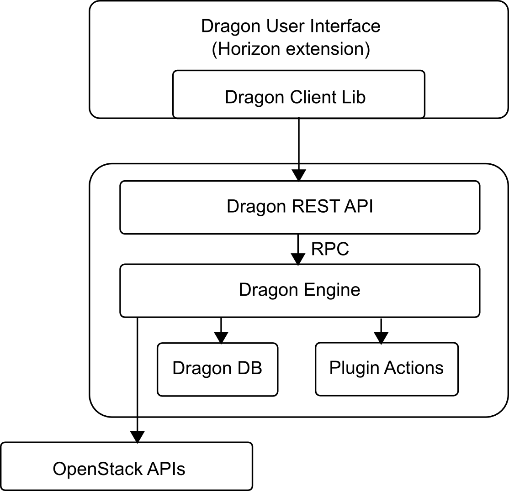

Architecture
==================================

High level architecture of the IBM  's Disaster Recovery service components

Dragon comprises a number of Python components:

dragon client (python-dragonclient)
-----------------------------------
A Python command line client and library that communicates and controls the DR API.

dragon-api
----------
The dragon-api component provides a REST API that processes API requests by sending them to the dragon-engine over RPC.

dragon-engine
-------------
The dragon engine does the main work of orchestrating the launch of protection or recovery actions, protection policy editing and providing events back to the API consumer.

dragon user interface
---------------------
A Horizon dashboard for visualizing the DR process, includes protect and recover panels
