====================
Protect a workload
====================

To set protection policies and select objects to protect connect to the primary cloud and Login as admin.

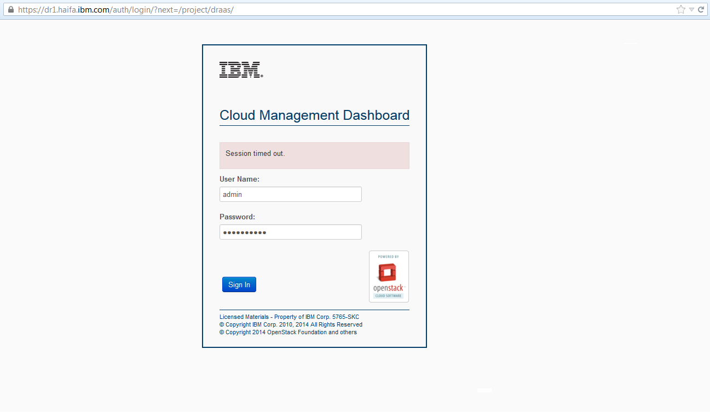
    
    Login at the primary cloud as Admin

Next, select the tenant whose workloads you wish to protect.

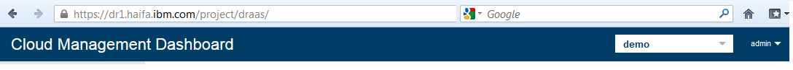
    
    Select the tenant from the drop down menu on the right side of the toolbar

On the left side panel, select Disaster Recovery->Protect Workload to see the list of protection policies.

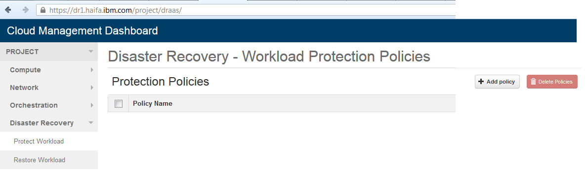
    
    Accessing the "Protect Workload" page from the "Disaster Recovery" menu on the left panel

In order to add a new Protection policy, click "add policy" button.
You will need to provide a mnemonic name for the new policy.

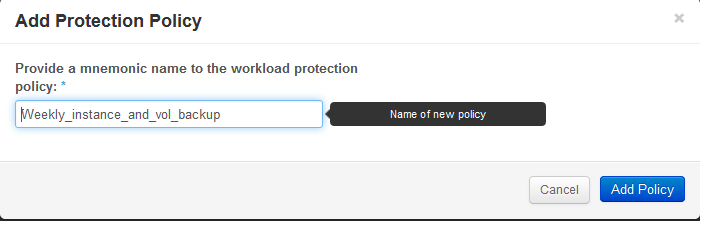
    
    Providing a name for a new protection policy

To add resources to the protection policy, click the "add resource" button

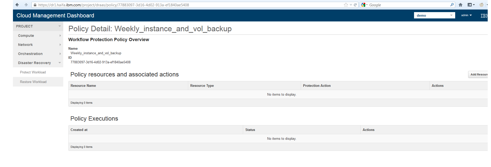
    
    Policy view with associated resources and policy executions

On the Manage Resources page, select the resources to be protected using the current policy

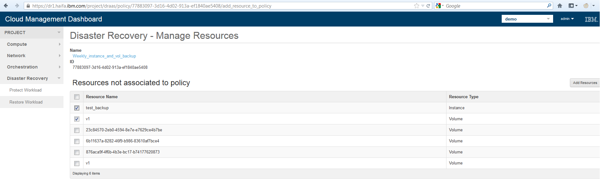
    
    List of resources not yet associated to the current policy. Use the check boxes to add resources to be protected to the policy.

Adding a resource to a policy, the resource will be associated to a default protection depending on the resource type. The default protection action for volumes is "Volume Snapshot", while for instances it is "Image Snapshot".
You can change the protection action of each resource through the edit action button on each resource line.

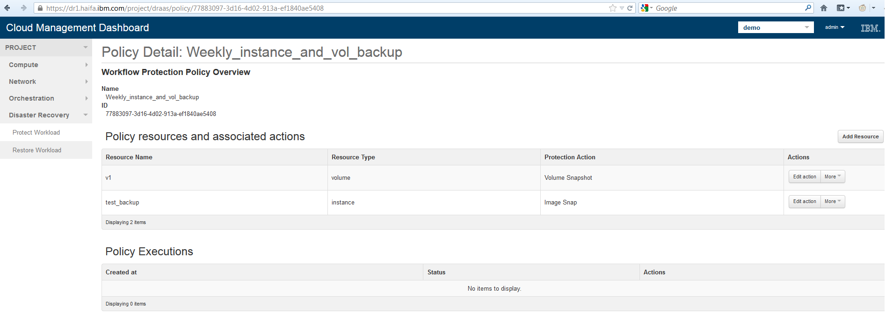
    
    A policy with its protected resources and associated actions. The "Edit action" button allows to set the desired protection action for each resource.

Back to the "Protect Workload" page, in order to execute the actions of a workload policy, click the trigger policy button.

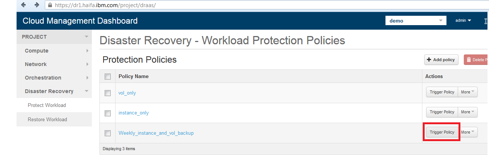
    
    The "Trigger Policy" button starts the execution of the protection actions on the policy resources.

 
Each time a workload policy is triggered, a workload policy execution object is created.
A workload policy execution  lists all the steps of the actions as they are performed, their outcome, and indicates the protection status for each resource.

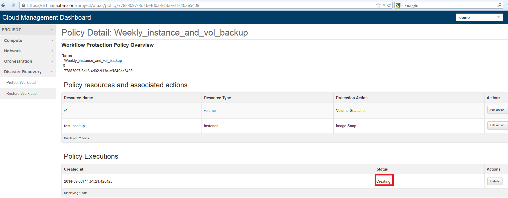
    
    The policy execution status while the policy is being executed is labeled "Creating".

If all workload policy actions are executed successfully, the policy execution will update its status to "Protected". Otherwise, the "Error" status is shown.

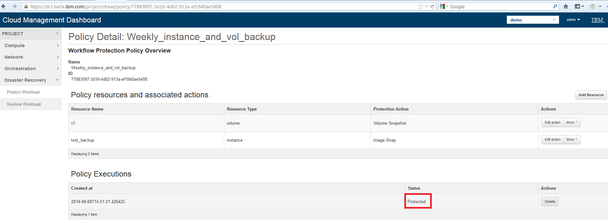
    
    Once all policy actions have been completed successfully, the policy execution status changes to "Protected"

Clicking on the "details" button of an execution policy will show the list of resources and the steps taken in their protection actions.
for instance, in the weekly protection policy, two resources were protected: an instance named "test_backup" and the volume "v1".
The former was protected using an Instance Snapshot action. The instance was cloned, a snapshot was created and next uploaded to Swift.
For the v1 Volume, volume cloning and snapshot where also executed.
A complete point in time for recovery was created.

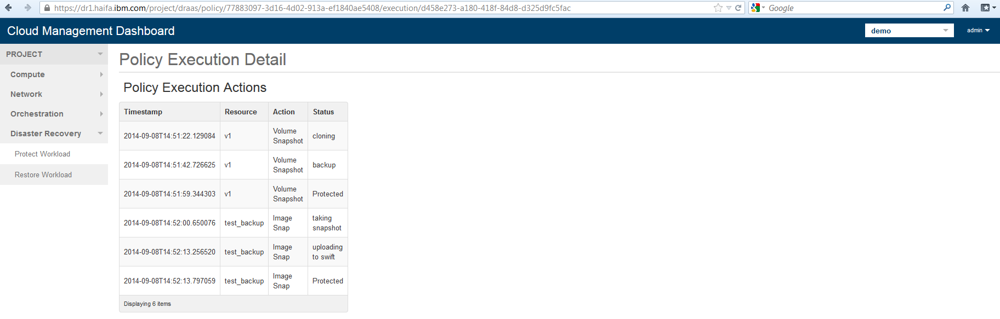
    
    The action steps and their status of a successful policy execution protecting an instance and a volume

