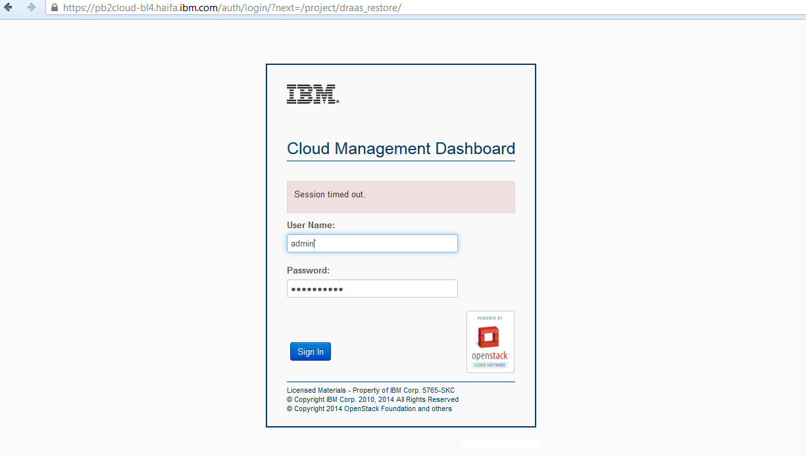
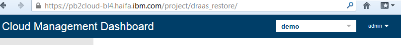
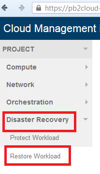
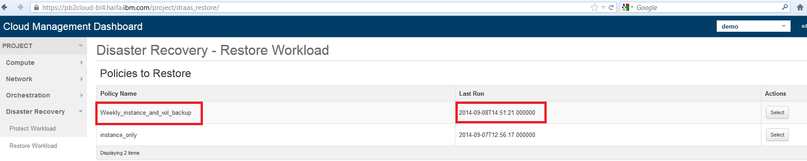
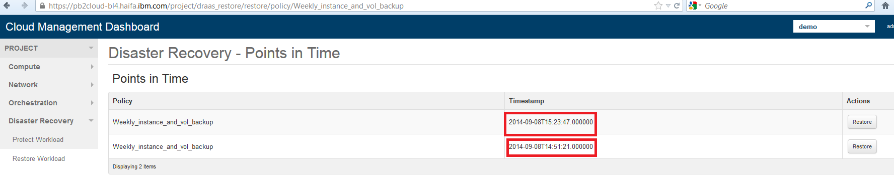

=====================
Recover a workload 
=====================
 
To recover workloads that were protected using IBM  's Disaster Recovery feature, login into the secondary cloud with the admin user.

Note the following assumptions:

1. The secondary cloud has IBM  's Disaster Recovery components running (i.e. DB schema installed and populated with resource types and actions, Swift connected, etc.)

2. The secondary cloud is clean of resources (i.e. no resources with names that may be colliding with DR restored resources)

    
    Login as admin to the secondary site

Next, select the tenant whose workloads are to be restored.

    
    Choose the tenant from the drop-down menu in the toolbar.

On the left panel, select Disaster Recovery -> Restore workload

    
    The "Restore Workload" option in the disaster recovery menu

Choose the workload to be restored from the list of workload policies with points in time available for restore.

    
    The list of protection policies available for restore

For each policy, all available points in time available for restore are listed, with their timestamp. Each point in time includes a status and a status.log file with indications of the backup state.
Points in time are sorted by the time it was taken, with the most recent one first.

    
    The list of available points in time for restore of a protection policy

Click the recover button to start restoring the workload

.. figure:: bl4_6.png
    :align: center
    :width: 90% 
    
    The restore button triggers the actions needed to recreate the protected resources from the policy

Now you can switch to the Orchestration tab on the left, and watch your stack being deployed from the point in time .

Note that all workload policies are restored as well to enable protection on the secondary site.

 

Fallback
========

        As for now, full fallback only is supported.

        To fallback, make sure you protect the workload policies on the secondary cloud, next clean the primary from objects and DR data, and invoke the recover on the primary cloud
